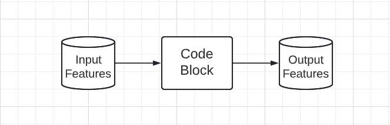
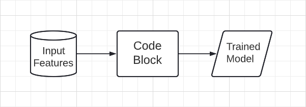

# Code Blocks with inputs and outputs

The basic unit captured by Orchestra represents a single run of a Code Block, with specific input Features, to produce specific output Features.

The same logic is applied for Code Blocks that are used to train ML Models. Orchestra captures information about the input Features and the Code Block, which is then associated with the output (Trained) Model .

This information is then attached to the output Features and Models, so that the information about the Code Block and Input Features that were used to create them are available later.

.png>)

This information is provided to Orchestra in two main ways:

1. The `orchestra.log_data_code().start()` and `.end()` commands. These indicate the beginning and end of each code block, and can include information about in-memory data sources (i.e. pandas dataframes) or model objects that are input to or output from the code block.
2. The `orchestra.log_features()` **** and **** `orchestra.log_model()` **** commands. These capture information about inputs and outputs that are read from or written to external sources, and tie the info about the external (persisted) object to its corresponding in-memory object. Features are associated with Data Sources like local files, database tables, cloud storage, and Models are associated with their Model Registry / storage location. The features and models in these external locations are also considered to be inputs or outputs of the given code block (even though they are not passed directly in the function).

For more details see the section [instrumenting-code.md](instrumenting-code.md "mention").


If each code block corresponds to a user-defined python function, the standard convention in Orchestra is to add the start/end lines _inside_ the function (at the very beginning and very end), and to use the name of the function as the name for the code block.


